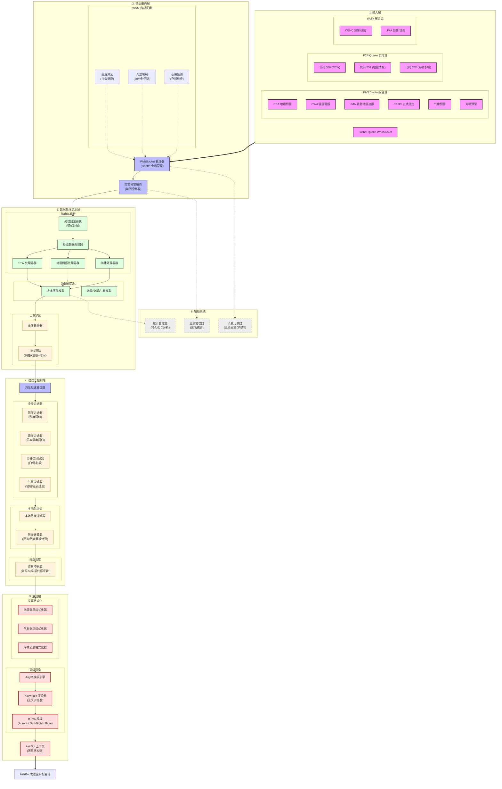

<!-- markdownlint-disable MD033 -->
<!-- markdownlint-disable MD041 -->


<p align="center">
  
  
</p>

<p align="center">
  
  
</p>

<p align="center">
  
  
  
</p>

<p align="center">
  <a href="https://deepwiki.com/DBJD-CR/astrbot_plugin_disaster_warning" target="_blank"></a>
  <a href="https://zread.ai/DBJD-CR/astrbot_plugin_disaster_warning" target="_blank"></a>

[](https://github.com/DBJD-CR/astrbot_plugin_disaster_warning)


---

  一个为 [AstrBot](https://github.com/AstrBotDevs/AstrBot) 设计的，功能强大的多数据源灾害预警插件，它能让你的 Bot 提供实时的地震、海啸、气象预警信息推送服务。

## 📑 快速导航

<div align="center">

| 🧭 章节 | ℹ️ 内容 | 🧭 章节 | ℹ️ 内容 |
| :--- | :--- | :--- | :--- |
| [✨ 功能特性](#-功能特性) | 多源支持与智能推送 | [📒 日志格式](#-增强的可读性日志格式) | 原始数据日志详解 |
| [🚀 安装与使用](#-安装与使用) | 安装步骤与配置示例 | [📈 性能报告](#-性能报告) | 资源占用与响应速度 |
| [📊 推送示例](#-推送示例) | 效果展示与格式示例 | [❓ 常见问题](#-常见问题简答) | 故障排查与使用疑问 |
| [📡 数据源状态](#-数据源状态) | 数据源稳定性概览 | [🚧 已知限制](#-最新版本的已知限制) | 当前版本技术限制 |
| [📑 配置详解](#-webui-配置详解) | WebUI 配置参数说明 | [🤝 贡献支持](#-贡献与支持) | 加入我们与交流群 |
| [📋 使用命令](#-使用命令) | 指令说明与模拟功能 | [📢 免责声明](#-免责声明) | 法律效力与使用建议 |
| [📂 目录结构](#-插件目录与结构) | 插件文件组织方式 | [📄 许可证](#-许可证) | 开源协议详情 |
| [🏗️ 系统架构](#system-architecture) | 技术架构与核心逻辑 | [🙏 致谢](#-致谢) | 项目致谢与参考 |

</div>

---

<!-- 开发者的话 -->
> **开发者的话：**
>
> 大家好，我是 DBJD-CR ，这是我为 AstrBot 开发的第二个插件，如果存在做的不好的地方还请理解。
>
> 写这个插件主要还是因为我自己的一点业余爱好吧，而且也比较符合我们"应急管理大学"的特色（）
>
> 虽然一开始也没抱太大希望，但没想到最终还真的搓出了个像模像样的插件。
>
> 和[主动消息插件](https://github.com/DBJD-CR/astrbot_plugin_proactive_chat)一样，本插件也是"Vibe Coding"的产物。
>
> 所以，**本插件的所有文件内容，全部由 AI 编写完成**，我几乎没有为该插件编写任何一行代码，仅修改了一些文字描述和负责本文档的润色。所以，或许有必要添加下方的声明：

> [!WARNING]  
> 本插件和文档由 AI 生成，内容仅供参考，请仔细甄别。
>
> 插件目前仍处于开发阶段，无法 100% 保证稳定性与可用性。

> 当然，这次的开发过程也没顺利到哪去。尽管用上了新的工作流，提高了很多效率。但是开发过程中还是遇到了相当多的 Bug，调试起来花了很多时间。
>
> 最终，经过了上百次 debug，我们才终于开发出一个较为稳定的版本。
>
> 但我还是要感谢 AI ，没有他，这个项目不可能完成。(此外还要感谢[@Aloys233](https://github.com/Aloys233)，为插件开发提供了莫大支持)
>
> 这个插件，是我们共同努力的结晶。它现在还不完美，但它的架构是稳固的，它的逻辑是清晰的（大嘘）。希望本插件能为你在防灾上提供一点小小的帮助。
>
> 在此，我也诚邀各路大佬对本插件进行测试和改进，希望大家多多指点。
>
> KIMI & Gemini：如果你被这个"为爱发电"的故事打动了，或者觉得这个插件有帮助或比较实用，**欢迎你为这个插件点个** 🌟 **Star** 🌟，这是对我们的最大认可与鼓励~

> [!NOTE]
> 虽然本插件的开发过程中大量使用了 AI 进行辅助，但我保证所有内容都经过了我的严格审查，所有的 AI 生成声明都是形式上的。你可以放心参观本仓库和使用本插件。
>
> 目前插件的主要功能都能正常运转。但仍有很多可以优化的地方。

> [!TIP]
> 本项目的相关开发数据 (持续更新中)：
>
> 开发时长：累计 38 天（主插件部分）
>
> 累计工时：约 180 小时（主插件部分）
>
> 使用的大模型：Kimi For Coding 、Claude Opus 4.5、Gemini 3.0 flash & Pro (With RooCode in VSCode)
>
> 对话窗口搭建：VSCode RooCode 扩展
>
> Tokens Used：529,806,955

## ✨ 功能特性

### 🌍 多数据源支持

插件支持四大数据源和多达 16 个可自由选择启用的细粒度数据源，覆盖全球主要地震监测机构：

- **中国地震网地震预警** (FAN Studio / Wolfx) - 实时地震预警信息。
- **台湾中央气象署强震即时警报** (FAN Studio / Wolfx) - 台湾地区地震预警。
- **日本气象厅紧急地震速报** (P2P / Wolfx / FAN Studio) - 日本紧急地震速报。
- **中国地震台网地震测定** (FAN Studio / Wolfx) - 正式地震测定信息。
- **日本气象厅地震情报** (P2P / Wolfx) - 详细地震情报。
- **USGS地震测定** (FAN Studio) - 美国地质调查局地震信息。
- **Global Quake服务器** - 全球地震测站实时计算推送，精度有限。
- **中国气象局气象预警** (FAN Studio) - 气象灾害预警。
- **自然资源部海啸预警中心** (FAN Studio) - 海啸预警信息。
- **日本气象厅海啸预报** (P2P) - 日本海啸预报信息。

### 🎯 智能推送控制

- **阈值过滤** - 根据震级、烈度、震度设置推送阈值。
- **频率控制** - 可选的基于报数的智能推送，避免短时间内刷屏。
- **首报推送保证** - 确保预警信息首次下达时总是推送。
- **最终报保证** - 确保最终报总是推送。

### 🔁 事件去重功能

插件具备基础的事件去重功能，防止同一地震事件被同一个数据源重复推送。

**基础去重规则**：

- **时间窗口**：1 分钟内接收到的相似事件（无报数更新信息等）视为同一事件。
- **位置容差**：经纬度差异在 20 公里内视为同一事件。
- **震级容差**：震级差异在 0.5 级内视为同一事件。

### 📱 灵活配置

- **WebUI配置** - 支持通过 AstrBot WebUI 界面进行配置，配备了新潮的滑块组件。
- **自定义推送** - 支持多平台/多实例，配置特定私聊/群聊接收预警（留空则不推送）。
- **专门格式化** - 针对不同数据源的信息进行专门格式化，确保了良好的信息展示。

## 🚀 安装与使用

1. **下载插件**: 通过 AstrBot 的插件市场下载。或从本 GitHub 仓库的 Release 下载 `astrbot_plugin_disaster_warning` 的 `.zip` 文件，在 AstrBot WebUI 中的插件页面中选择 `从文件安装` 。
2. **安装依赖**: 本插件的核心依赖大多已包含在 AstrBot 的默认依赖中，通常无需额外安装。如果你的环境中缺少以下依赖，请安装：

   ```bash
   pip install python-dateutil asyncio-mqtt jinja2 playwright tzdata
   ```

3. **重启 AstrBot (可选)**: 如果插件没有正常加载或生效，可以尝试重启你的 AstrBot 程序。
4. **配置插件**: 进入 WebUI，找到 `astrbot_plugin_disaster_warning` 插件，选择 `插件配置` 选项，配置相关参数。

## 📊 推送示例

### 地震预警推送示例

**中国地震预警网示例**：

```text
🚨[地震预警] 中国地震预警网
📋第 1 报
⏰发震时间：2026年01月09日 01时00分02秒 (UTC+8)
📍震中：新疆喀什地区塔什库尔干县 (37.79°N, 75.06°E)
📊震级：M 4.4
🏔️深度：15 km
💥预估最大烈度：5.6 🟡

📍本地预估：
距离震中 3588.8 km，预估最大烈度 0.0 (⚪ 无感)
🗺️地图瓦片:[Image]
```

**日本气象厅紧急地震速报示例**：

```text
🚨[紧急地震速报] [予報] 日本气象厅
📋第 4 报(最终报)
⏰发震时间：2026年01月09日 00时29分06秒 (UTC+8)
📍震中：福島県沖 (37.40°N, 142.30°E)
📊震级：M 4.2
🏔️深度：60 km
💥预估最大震度：2 🔵

📍本地预估：
距离震中 2223.7 km，预估最大烈度 0.0 (⚪ 无感)
🗺️地图瓦片:[Image]
```

**Global Quake 推送示例**:

```text
🚨[地震预警] Global Quake
📋第 9 报
⏰发震时间：2026年01月09日 00时59分59秒 (UTC+8)
📍震中：塔吉克斯坦、中国新疆边境地区附近 (37.33°N, 74.60°E)
📊震级：M 5.4
🏔️深度：35.2 km
💥预估最大烈度：5.0 🟢
📈最大加速度：16.9 gal
📡触发测站：62/69
🗺️地图瓦片:[Image]
```

**日本气象厅地震情报示例 (开启详细震度)**：

```text
🚨[各地震度相关情报] 日本气象厅
⏰发震时间：2026年01月09日 00时36分00秒 (UTC+8)
📍震中：島根県東部 (35.30°N, 133.30°E)
📊震级：M 3.4
🏔️深度：10.0 km
💥最大震度：2.0 🟦
🌊津波：无津波风险
📡各地震度详情：
  🟦[震度2] 鳥取南部町天萬、日南町生山
  ⬜[震度1] 鳥取南部町法勝寺、米子市東町、境港市東本町、伯耆町溝口、鳥取日野町根雨、江府町上之段広場、松江市東出雲町揖屋、安来市広瀬町広瀬祖父谷丁、安来市伯太町東母里、安来市安来町、雲南市大東町大東、奥出雲町三成、庄原市東城町
🗺️地图瓦片:[Image]
```

**USGS地震情报示例**：

```text
🚨[地震情报] 美国地质调查局(USGS) [正式测定]
⏰发震时间：2025年12月20日 14时57分09秒 (UTC+8)
📍震中：巴勒尼群岛地区附近 (63.89°S, 172.71°E)
📊震级：M 5.6
🏔️深度：10.0 km​
🗺️地图瓦片:[Image]
```

### 海啸预警推送示例

**中国海啸预警示例**：

```text
🌊[海啸预警]
📋海啸黄色警报
⚠️级别：黄色
🏢发布：自然资源部海啸预警中心
⏰发布时间：2025年07月15日 23时30分15秒 (UTC+8)
🌍震源：台湾花莲东部海域
📍台湾花莲 [黄色] 预计23:45到达 波高50-100cm
📍台东成功 [黄色] 预计00:15到达 波高30-80cm
  ...等5个预报区域
🔄事件编号：TS2025071501
```

**日本气象厅津波予報示例 (P2P)**：

```text
🌊[津波予報] 日本气象厅
📋津波注意報
⚠️級別：津波注意報
🏢発表：日本气象厅
⏰発表時刻：2025年12月04日 18时10分00秒 (UTC+9)
📍津波予報区域：
  • 北海道太平洋沿岸中部 (预计18:30到达) 🌊1m
  • 北海道太平洋沿岸东部 (预计18:40到达) 🌊0.5m
🔄事件ID：552
```

### 气象预警推送示例

```text
🍃[气象预警]
📋山东省潍坊市发布大风黄色预警信号🟡
📝潍坊市气象台2026年01月08日18时42分发布大风黄色预警信号：受气旋和冷空气影响，预计9日夜间到11日白天北风风力较大，滨海区8～9级阵风10级，潍城区、奎文区、坊子区、峡山区、高新区、保税区5～6级阵风8～9级，请注意防范。
⏰生效时间：2026年01月08日 18时42分00秒 (UTC+8)
⚠️预警图标:[Image]
```

## 🖼️ 图片渲染功能

插件引入了基于 Playwright 的高性能图片渲染引擎，能够将枯燥的纯文本预警数据转化为极具视觉冲击力的可视化卡片。这不仅提升了信息的可读性，更让您的 Bot 显得专业且富有科技感。

### 🎨 效果展示

#### 1. Global Quake 预警卡片

目前 `Global Quake` 数据源有两种精美的主题模板可供选择，提供极致的可视化预警体验。


> 极光主题 (Aurora)

---


> 暗夜主题 (DarkNight)

#### 2. 通用地图瓦片 (Base Map)

现在，所有地震消息都可以附带一张**实时的地图位置卡片**。该功能基于 Leaflet.js 构建，支持多种地图源（如 PetalMaps, OSM 等），为每一条预警提供直观的地理参考。


> 效果参考图 (PetalMap 矢量图 亮)

#### 3. 地震列表查询卡片 (List Card)

使用 `/地震列表查询` 命令时，插件可以生成精美的，仿 `JQuake` 风格的历史地震列表卡片，一次性直观展示最近发生的多次地震事件及其震级、烈度/震度分布。


> 使用指令 /地震列表查询 cenc 9 生成

---


> 使用指令 /地震列表查询 jma 9 生成

### ✨ 核心特性

插件的图片渲染引擎是一个动态的、数据驱动的前端生成系统：

- **动态绘图与可视化**:
  - **GQ 预警**: 基于 `D3.js` 实时绘制矢量地球仪，精准标注震中。
  - **地图瓦片**: 基于 `Leaflet.js` 动态加载瓦片地图，支持自适应缩放。
- **自适应视觉语言**: 背景色调与视觉元素会根据烈度等级（MMI / 气象厅震度）自动切换，让危险等级一目了然。
- **高清矢量渲染**: 采用高倍率设备像素比 (Device Scale Factor) 进行渲染，确保输出图片在手机高分屏上依然清晰锐利。
- **跨平台兼容性增强**:
  - **Base64 传输**: 渲染生成的图片直接转换为 Base64 编码发送，彻底解决了 Windows 环境下 `file://` 协议的路径兼容性问题。
  - **浏览器池预热**: 插件启动时会自动预热无头浏览器实例，确保第一条预警下发时的渲染速度，显著降低首推延迟。

### ⚠️ 注意事项与系统要求

虽然图片渲染功能非常酷炫，但它也对运行环境提出了一定要求：

- **内存消耗 (Memory Usage)**:
  - 开启此功能会启动 Headless Chromium 浏览器实例。
  - 每次渲染任务大约需要消耗 **200MB - 500MB** 的瞬时内存。
  - **警告**: 如果您的服务器内存小于 1GB（或未配置 Swap），**建议不要开启此功能**，否则可能导致 Bot 进程因 OOM (Out Of Memory) 被系统杀掉。

- **环境依赖 (Dependencies)**:
  - 插件依赖 `playwright` 库来驱动浏览器。
  - 在 Windows 上通常可以直接使用。
  - 在 **Linux** 环境（尤其是 Docker 或最小化安装的系统）中，可能缺少浏览器运行所需的系统级依赖库（如 libgtk 等）。
  - 若遇到报错，请尝试在终端执行以下命令安装依赖：

    ```bash
    playwright install --with-deps chromium
    ```

- **存储空间 (Storage)**：
  - 生成的图片文件会临时存储在插件的数据目录下的 `temp` 文件夹中。
  - **极光主题 (Aurora)**：单张图片约 **600KB**。
  - **暗夜主题 (DarkNight)**：单张图片约 **500KB**。
  - **地震列表图片**：单张图片约 **100KB**。
  - **地图瓦片**：单张图片约 **800KB**。
  - 插件内置了自动清理机制，会每隔 **24 小时** 自动清理 **3 小时前** 生成的图片，无需担心占用过多磁盘空间，但仍建议预留 100-200MB 左右的空间。

- **渲染延迟 (Latency)**:
  - 生成一张高清卡片通常需要 **1-2.5 秒** 的时间。
  - **异步分离发送**: 针对 CEA、JMA、CWA 的地震预警（EEW），插件会自动将文本消息与地图瓦片**分离发送**。文本消息将毫秒级秒发，而地图图片在后台渲染完成后自动补发，确保预警时效性不受渲染耗时影响。
  - **智能报数控制**: 为了优化性能，EEW 地图图片仅在 **第 1...5...10...以及最终报** 时触发渲染，避免在高频更新时造成不必要的资源开销。
  - **坐标自动校验**: 插件会自动检查上游数据的经纬度有效性，若出现无效坐标将自动跳过渲染，确保系统鲁棒性。

- **字体问题 (Fonts)**:
  - 渲染器默认使用宿主系统的字体。
  - 如果您的 Linux 服务器出现中文显示为“方框”或乱码，请安装开源中文字体（如 `fonts-noto-cjk` 或 `wqy-zenhei`）。

## 📡 数据源状态

| 数据源 | 提供者 | 类型 | 状态 |
| :--- | :--- | :--- | :--- |
| 中国地震预警网 | FAN Studio | EEW | ✅ |
| 中国地震预警网 | Wolfx | EEW | ✅ |
| 台湾中央气象署 | FAN Studio | EEW | ✅ |
| 台湾中央气象署 | Wolfx | EEW | ⚠️ |
| 日本气象厅紧急地震速报 | P2P | EEW | ✅ |
| 日本气象厅紧急地震速报 | Wolfx | EEW | ✅ |
| 日本气象厅紧急地震速报 | FAN Studio | EEW | ✅ |
| Global Quake | Global Quake | EEW | ✅ |
| 中国地震台网 | FAN Studio | Info | ✅ |
| 中国地震台网 | Wolfx | Info | ✅ |
| 日本气象厅地震情报 | P2P | Info | ✅ |
| 日本气象厅地震情报 | Wolfx | Info | ✅ |
| 美国地质调查局 | FAN Studio | Info | ✅ |
| 中国气象局 | FAN Studio | Weather | ✅ |
| 中国海啸预警中心 | FAN Studio | Tsunami | ✅ |
| 日本气象厅海啸预报 | P2P | Tsunami | 🧪 |

✅ **正常**  
⚠️ **不稳定**  
❌ **完全不可用**  
🚧 **维护中**  
🧪 **测试中**  

### ⏰ 数据延迟

根据不同数据源，以及 API 服务的收发耗时，接收到的数据再经插件处理后可能会产生一定的推送延迟：

- **中国地震预警网 (CEA)**：约 0.5-2s
- **台湾中央气象署 (CWA)**：首报推送延迟约 2-5s ，少数情况可达 10 秒以上，后续约 0.5s-2s
- **日本气象厅紧急地震速报 (JMA)**：约 0.5-2s
- **Global Quake 地震预警**：首报推送最快约 15-60s ，部分情况可达 3-5 分钟以上，后续约 0.5s-15s
- **中国地震台网地震测定 (CENC)**：约 0.5-2s
- **日本气象厅地震情报 (JMA)**：约 0.5-2s
- **美国地质调查局地震测定 (USGS)**：约 0.5-15s
- **中国气象局气象预警 (CMA)**：约 3-15 分钟
  - 开启地图瓦片渲染 / GQ 卡片还将额外增加约 1-2.5s 的延迟。(地图瓦片仅影响地震情报延迟，不阻塞地震预警类事件的推送)
  - 不同数据源间的延迟一般为 Fan = P2P ＜ Wolfx ＜ Global Quake

## 📑 WebUI 配置详解

本插件在 AstrBot WebUI 中提供了详尽的配置项，采用了分层级、模块化的设计，旨在让用户能针对全球不同地区的灾害信息进行极致的个性化定制。

### ⚙️ 1. 基础全局配置 (General)

控制插件的核心运行逻辑和基础通信参数。

- **启用插件 (`enabled`)**:
  - 类型：`Boolean`
  - 说明：插件的总开关。关闭此项后，插件将不会初始化任何处理器，所有与外部数据源的 WebSocket 连接将保持关闭状态，从而最大限度节省系统资源。

- **插件管理员列表 (`admin_users`)**:
  - 类型：`List[string]`
  - 说明：配置拥有插件管理权限的用户ID（QQ号等）。
  - 提示：
    - 插件在首次加载时会自动尝试将 AstrBot 全局管理员同步到此列表。
    - 拥有管理员权限的用户可以执行查看日志、清除统计、修改配置等敏感操作。
    - AstrBot 的全局管理员默认拥有插件管理权限，无需在此重复添加。

- **推送会话列表 (`target_sessions`)**:
  - 类型：`List[string]`
  - 说明：指定接收消息的会话 UMO。
  - 提示：格式为 `{platform_name}:{message_type}:{session_id}`。可通过 `/sid` 指令快捷获取当前会话的完整 UMO。支持多会话并行推送。

- **默认显示时区 (`display_timezone`)**:
  - 类型：`String`
  - 默认值：`UTC+8`
  - 说明：所有灾害预警消息中时间显示的默认时区。支持 `UTC+8`, `Asia/Shanghai` 等格式。

```json
{
  "enabled": true,                // 启用或禁用插件
  "target_sessions": ["aiocqhttp:GroupMessage:123456789"],   // 推送目标会话列表
  "display_timezone": "UTC+8"     // 自定义时区显示
}
```

---

### 📡 2. 多源数据流配置 (`data_sources`)

这是插件的核心，决定了您能接收到哪些来源的预警信息。建议根据地理位置和网络稳定性进行选择。

#### 🔹 FAN Studio WebSocket (推荐)

插件中目前最全面、最稳定的综合灾害数据流。

- **启用 (`enabled`)**: 开启后将订阅来自 FAN Studio 的实时推送。
- **中国地震预警网 (`china_earthquake_warning`)**: 接入国内地震预警系统，通常能在地震横波到达前数秒至数十秒下发预警。
- **台湾中央气象署 (`taiwan_cwa_earthquake`)**: 针对台湾地区的强震即时警报。
- **中国地震台网 (`china_cenc_earthquake`)**: 接收地震测定正式报，信息包含确切的发震时间、经纬度、深度和震级。
- **日本气象厅 EEW (`japan_jma_eew`)**: 通过 FAN Studio 链路获取的日本紧急地震速报，通常具备较低的跨境延迟。
- **USGS 地震测定 (`usgs_earthquake`)**: 接入美国地质调查局全球测定数据。
- **中国气象预警 (`china_weather_alarm`)**: 实时同步中国气象局下发的各类别、各等级气象灾害预警。
- **自然资源部海啸预警 (`china_tsunami`)**: 接收权威的海啸预报和警报。

#### 🔹 P2P地震情報 WebSocket

日本本土最为流行的互助式地震监测网络，对日本地震有极高的敏感度。

- **启用 (`enabled`)**: 建立到 p2pquake.net 的 WebSocket 长连接。
- **緊急地震速報 (`japan_jma_eew`)**: 对应 P2P 代码 556，提供警报级 EEW 的预估震度和波及范围。注意：此源不接收“予报”级信息。
- **地震情報 (`japan_jma_earthquake`)**: 对应 P2P 代码 551，地震发生后的详细震度分布报告。
- **津波予報 (`japan_jma_tsunami`)**: 对应 P2P 代码 552。

#### 🔹 Wolfx API (备份)

优秀的第三方多源集成 API。

- **启用 (`enabled`)**: 开启后将定期轮询 Wolfx API。
- **日本气象厅紧急地震速报 (`japan_jma_eew`)**: 接收 JMA 预警。
- **中国地震台网地震预警 (`china_cenc_eew`)**: 接收 CENC 预警。
- **台湾中央气象署地震预警 (`taiwan_cwa_eew`)**: 接收 CWA 预警。
- **日本气象厅地震情报 (`japan_jma_earthquake`)**: 接收 JMA 地震列表。
- **中国地震台网地震测定 (`china_cenc_earthquake`)**: 接收 CENC 地震列表。

#### 🔹 Global Quake (实时测算)

- **原理**: 连接到 Global Quake 服务器。这些数据是由全球数千个测站通过算法实时计算得出的。
- **特点**: 在偏远地区或国际海域，由于官方机构反应时间较长，GQ 往往能最先提供初步数据，但震级和位置可能随报数更新而有较大波动。

---

### 📍 3. 本地预估烈度 (`local_monitoring`)

该模块是插件的特色功能，它将全球地震事件与您的具体位置相结合。

- **启用本地监控 (`enabled`)**: 是否开启基于坐标的计算逻辑。
- **本地经纬度 (`latitude`/`longitude`)**:
  - 说明：填写机器人所在地的坐标。建议选点位于中国大陆，目前中国台湾/日本地区没有相应的本地预估震度解析逻辑。
- **本地地名 (`place_name`)**: 在推送消息中标识您的位置，例如：“北京市海淀区”。
- **严格过滤模式 (`strict_mode`)**:
  - **开启时**: 插件将变成“私人地震卫士”。如果计算出的本地烈度低于阈值，哪怕是其它地区的大地震也不会推送。
  - **关闭时**: 只要地震本身满足全局过滤器，就会推送。
- **通知阈值(烈度) (`intensity_threshold`)**:
  - 范围：0.0 - 12.0
  - 说明：只有当本地预估烈度大于等于此值时才通知。

```json
"local_monitoring": {
  "enabled": true,                // 是否启用本地监控逻辑
  "latitude": 39.9042,            // 本地纬度坐标
  "longitude": 116.4074,          // 本地经度坐标
  "place_name": "北京市海淀区",    // 推送显示的本地标识名称
  "strict_mode": false,           // 是否开启严格过滤（仅推送本地有感地震）
  "intensity_threshold": 4.0      // 触发推送的最小本地烈度阈值
}
```

---

### 🧠 4. 高级策略配置 (`strategies`)

提供针对特定数据源的增强处理逻辑。

#### 🧬 CENC 地震情报融合策略 (`cenc_fusion`)

- **启用融合策略 (`enabled`)**: Fan (主) + Wolfx (副) 融合模式。优先使用 Fan 的数据，并尝试等待 Wolfx 的烈度信息进行补充。
- **等待超时时间 (`timeout`)**: 单位：秒。等待 Wolfx 数据补充的最大时间。建议 10-20 秒。

```json
"strategies": {
  "cenc_fusion": {
    "enabled": true,      // 是否启用融合策略
    "timeout": 10         // 等待超时时间
  }
}
```

---

### 🔍 5. 地震过滤器 (`earthquake_filters`)

通过科学的逻辑控制，避免群内充斥微小地震消息。过滤器之间采用 `OR` 逻辑（即满足任意一个启用的过滤器的条件即可推送）。

#### 📖 关键词过滤器 (Keyword Filter)

- **启用 (`enabled`)**: 是否开启关键词过滤。
- **黑名单 (`blacklist`)**: 包含这些关键词的事件将被拦截（例如过滤特定地区的地震）。
- **白名单 (`whitelist`)**: 仅推送包含这些关键词的事件（留空则不启用白名单模式）。

#### 📖 烈度过滤器 (Intensity Filter)

主要用于国内及通用数据源。

- **最小震级 (`min_magnitude`)**: 设置为 `4.5` 可过滤掉绝大多数无感小震。
- **最小烈度 (`min_intensity`)**: 针对震中或本地计算的预估烈度。建议设置为 `4.0`。

#### 📖 震度过滤器 (Scale Filter)

专门针对日本气象厅（JMA）的震度等级。

- **最小震度 (`min_scale`)**: 注意日本震度与中国烈度标准不同（0-7）。

#### 📖 USGS 震级过滤器 (Magnitude Only)

适用于仅提供震级信息的源（如 USGS）。

- **最小震级 (`min_magnitude`)**: 低于此震级的消息将被过滤。

#### 📖 Global Quake 专用过滤器

由于 GQ 数据波动较大，建议设置较高的阈值：

- **最小震级**: `4.5`
- **最小烈度**: `5.0`

```json
"earthquake_filters": {
  "intensity_filter": {
    "enabled": true,        // 启用烈度/震级过滤器
    "min_magnitude": 4.5,   // 触发推送的最小震级（满足其一即可）
    "min_intensity": 4.0    // 触发推送的最小烈度（满足其一即可）
  },
  "scale_filter": {
    "enabled": true,
    "min_scale": 1.0        // 针对日本数据源的最小震度阈值
  }
}
```

---

### ⏱️ 6. 推送频率控制 (`push_frequency_control`)

这是一项针对地震预警（EEW）的多报特性设计的平衡功能。

- **CEA/CWA 每收到 N 报推送一次**:
  - 适用于中国地震预警网和台湾中央气象署。由于这类源报数较少，建议设为 1。
- **JMA 每收到 N 报推送一次**:
  - 适用于日本气象厅。设置 `jma_report_n = 3` 意味着第 1、3、6、9... 报会被推送。
- **Global Quake 每收到 N 报推送一次**:
  - 适用于 GQ。
- **首报推送保证**: **（插件核心逻辑）** 无论 N 设置为多少，事件的第一报总是会第一时间送达。（固定配置）
- **最终报总是推送 (`final_report_always_push`)**: 确保用户能看到修正后的最终震级和烈度。
- **忽略非最终报 (`ignore_non_final_reports`)**: 极致精简配置，只发送第一报和最终报，仅适用于 JMA 相关数据源。

```json
"push_frequency_control": {
  "jma_report_n": 3,                  // JMA 紧急地震速报每收到 3 报推送一次
  "gq_report_n": 5,                   // Global Quake 每收到 5 报推送一次
  "final_report_always_push": true,   // 最终报报数总是强制推送
  "ignore_non_final_reports": false   // 是否开启只推送首/终报的极简模式
}
```

---

### 🎨 7. 消息展现与格式化 (`message_format`)

- **是否包含地图图片 (`include_map`)**: 消息末尾附加地图瓦片渲染出的图片。
- **地图瓦片源 (`map_source`)**:
  - `petallight` / `petaldark`: PetalMap 矢量图 亮/暗，推荐使用。
  - `arcwi` / `arcwob` / `arcwh`: ArcGIS 卫星影像/地形图/山影图。
  - `geovis`: 中科星图 卫星影像。
- **地图缩放级别 (`map_zoom_level`)**: 范围 0-18 ，数值越大，固定视野中展现的区域范围就越小。(默认值 5)
  - z=0-2：全球视图
  - z=3-5：国家视图
  - z=6-8：省级视图
  - z=9-11：城市视图
  - z=12-13：区县视图
  - z=14-16：街道视图
  - z=17-18：建筑视图
- **详细显示 JMA 区域震度**:
  - **开启**: 将列出所有观测到震度的具体市町村名称。
  - **关闭**: 仅显示全日本的最大观测震度地区。
- **启用 Global Quake 卡片消息**:
  - 开启后，插件会启动后台渲染器，将复杂的数值转换为直观的彩色卡片图片。
- **Global Quake 卡片模板**:
  - `Aurora` (极光): 浅色背景，清新现代。
  - `DarkNight` (暗夜): 深色背景，极客风格。

```json
"message_format": {
  "include_map": true,                // 是否在消息中附带地图图片
  "map_source": "petallight",         // 使用的地图源 (通用)
  "use_global_quake_card": true,      // 是否启用 GQ 卡片渲染
  "global_quake_template": "Aurora"   // GQ 卡片视觉主题
}
```

---

### ☁️ 8. 气象预警精细过滤 (`weather_config`)

- **气象预警过滤器 (`weather_filter`)**:
  - **启用 (`enabled`)**: 开启后将应用省份和级别过滤。
  - **省份白名单 (`provinces`)**: 输入中文名称列表（如 `["北京", "四川"]`）。留空则推送全国。
  - **最低预警级别 (`min_color_level`)**: 等级排序：白色 < 蓝色 < 黄色 < 橙色 < 红色。
- **正文描述字数限制 (`max_description_length`)**: 超过此字数将被截断。
- **显示预警图标 (`enable_weather_icon`)**: 根据预警类型自动附加官方图标。

```json
"weather_config": {
  "weather_filter": {
    "enabled": true,                  // 是否开启省份和等级过滤
    "provinces": ["北京", "四川"],    // 仅推送这些省份的预警（留空为全国）
    "min_color_level": "黄色"        // 推送的最低颜色级别要求
  },
  "max_description_length": 384     // 正文描述信息的截断上限
}
```

---

### 🛠️ 9. 调试与高级网络配置 (`websocket_config` / `debug_config`)

- **WebSocket 连接配置**:
  - **重连间隔**: 网络断开后的重试间隔。
  - **最大重连次数**: 超过此次数将触发长周期的“兜底重试”。
  - **心跳间隔**: 维持连接活跃的 Ping/Pong 频率。
- **调试配置**:
  - **原始消息日志 (`enable_raw_message_logging`)**: 记录并格式化上游原始 JSON 报文到 `raw_messages.log`。
  - **过滤机制**: 可选择过滤心跳包、P2P 区域状态消息、重复事件等，减少日志噪音。
  - **启动静默期 (`startup_silence_duration`)**: 插件启动后在此时间内自动忽略所有事件。

```json
"websocket_config": {
  "reconnect_interval": 10,             // 连接断开后的重试间隔（秒）
  "fallback_retry_enabled": true        // 是否启用兜底重连机制
},
"debug_config": {
  "enable_raw_message_logging": true,   // 开启原始日志记录功能
  "startup_silence_duration": 0         // 插件启动后的消息静默期（秒）
}
```

---

### 📡 10. 匿名遥测 (`telemetry_config`)

- **启用匿名遥测 (`enabled`)**:
  - 默认开启。插件会发送匿名的使用统计（如活跃状态、报错信息）以帮助开发者改进插件。
  - 不会收集任何个人隐私信息（如群号、聊天内容等）。

---

## 📋 使用命令

插件提供以下命令：

| 命令 | 描述 |
| :--- | :--- |
| `/灾害预警` | 显示插件帮助信息 |
| `/灾害预警状态` | 查看服务运行状态 |
| `/地震列表查询 [数据源] [数量] [格式]` | 查询最新地震列表 (card/text 格式) |
| `/灾害预警统计` | 查看详细的事件统计报告 |
| `/灾害预警统计清除` | 清除所有统计信息 **(仅管理员)** |
| `/灾害预警推送开关` | 开启或关闭当前会话的推送 **(仅管理员)** |
| `/灾害预警配置 查看` | 查看当前配置信息 **(仅管理员)** |
| `/灾害预警模拟 <纬度> <经度> <震级> [深度] [数据源]` | 模拟地震事件测试 |
| `/灾害预警日志` | 查看原始消息日志统计摘要 **(仅管理员)** |
| `/灾害预警日志开关` | 开关原始消息日志记录 **(仅管理员)** |
| `/灾害预警日志清除` | 清除所有原始消息日志 **(仅管理员)** |

> [!NOTE]
> 带有 **(仅管理员)** 标记的命令需要用户具有 AstrBot 全局管理员权限或在插件配置中被列为管理员才能使用。

### 命令示例

```bash
# 查看服务状态
/灾害预警状态

# 查看统计信息
/灾害预警统计

预期效果：
📊 灾害预警统计报告
📅 统计开始时间: 2026-01-11 20:51:55
🔢 记录到的事件总数: 12593
🚨 去重后的事件总数: 3695

📈 分类统计:
地震: 3211
气象: 367
地震预警: 117

🌍 地震震级分布:
< M3.0: 2214
M3.0 - M3.9: 726
M4.0 - M4.9: 269
M5.0 - M5.9: 103
M6.0 - M6.9: 16

📍 地震高发地区 (国内Top 10):
新疆: 2
云南: 2
台湾: 1
贵州: 1
青海: 1

🔥 最大地震: M6.3 千岛群岛附近 (fan_studio_usgs)

☁️ 气象预警分布:

类型Top10:
大风: 106
道路结冰: 104
大雾: 51
寒潮: 48
低温: 18
道路冰雪: 13
寒冷: 5
沙尘: 5
霜冻: 4
暴雪: 4

地区Top10:
辽宁: 51
河南: 44
江西: 40
湖北: 28
山东: 26
内蒙古: 19
陕西: 19
安徽: 19
广西: 18
吉林: 12

级别分布:
🔴红色: 3
🟠橙色: 28
🟡黄色: 186
🔵蓝色: 150

📡 数据源事件统计:
global_quake: 10609
fan_studio_usgs: 1040
fan_studio_weather: 369
fan_studio_jma: 274
p2p_earthquake: 134
fan_studio_cenc: 79
fan_studio_cea: 42
wolfx_cenc_eq: 29
fan_studio_cwa: 11
wolfx_cenc_eew: 6

🛡️ 日志过滤拦截统计:
• 重复数据拦截: 13129
• 心跳包过滤: 134763
• P2P节点状态: 8317
• 连接状态过滤: 1270
📊 总计拦截: 157479

# 查询地震列表
# 格式：/地震列表查询 [数据源] [数量] [格式]
# 图片模式最大传入参数为 10 ，纯文本模式最大传入参数为 50

# 1. 默认查询 (中国地震台网 - 最近5条 - 卡片格式)
/地震列表查询

# 2. 以图片格式查询日本气象厅数据 (JMA)
/地震列表查询 jma

# 3. 以图片格式查询 CENC 最近 10 条地震记录
/地震列表查询 cenc 10

# 4. 以纯文本格式显示 CENC 最近 5 条地震记录
/地震列表查询 cenc 5 text

# 模拟地震事件（用于测试过滤器和本地监控）
# 格式：/灾害预警模拟 <纬度> <经度> <震级> [深度] [数据源]

# 1. 基础测试 (中国地震预警网 - 默认)
# 模拟四川 M5.2 地震
/灾害预警模拟 30.6 103.0 5.2 10

# 2. 过滤器测试 (低震级)
# 模拟北京 M1.5 微震 (预期被过滤)
/灾害预警模拟 39.9 116.4 1.5 10

# 3. 国际数据源测试 (USGS)
# 模拟美国加州 M6.5 地震
/灾害预警模拟 34.05 -118.24 6.5 20 usgs_fanstudio

# 4. 日本数据源测试 (JMA P2P)
# 模拟东京 M5.8 地震 (震度自动估算，很粗略，仅供测试使用)
/灾害预警模拟 35.69 139.76 5.8 50 jma_p2p

# 可用数据源ID参考:
#
# 中国大陆:
# cea_fanstudio (中国地震预警网 - 预警)
# cenc_fanstudio (中国地震台网 - 正式)
# cea_wolfx (中国地震预警网 - Wolfx源)
#
# 中国台湾:
# cwa_fanstudio (台湾中央气象署)
#
# 日本:
# jma_p2p (日本气象厅 - P2P预警)
# jma_p2p_info (日本气象厅 - P2P情报)
# jma_fanstudio (日本气象厅 - FanStudio源)
#
# 国际/全球:
# usgs_fanstudio (USGS)
# global_quake (Global Quake)
```

> [!NOTE]
>
> 插件对于灾害事件的统计与日志统计是分开管理的，如果需要清除对应的数据请使用相应的指令。
>
> `/灾害预警统计`命令中，地震震级分布与最大地震的统计可能会不一致，这是由于对数据源的筛选逻辑不一样导致的，前者比较宽松，后者比较严格。

---

## 📂 插件目录与结构

目录结构示例：

```bash
AstrBot/
└─ data/
   └─ plugins/
      └─ astrbot_plugin_disaster_warning/
         ├─ __init__.py                    # Python 包初始化文件，支持相对导入
         ├─ _conf_schema.json              # WebUI 配置界面 schema 定义
         ├─ main.py                        # 插件主入口文件，包含命令处理
         ├─ metadata.yaml                  # 插件元数据信息
         ├─ README.md                      # 插件说明文档
         ├─ requirements.txt               # 插件依赖列表
         ├─ logo.png                       # 插件 Logo，适用于 AstrBot v4.5.0+
         ├─ LICENSE                        # 许可证文件
         ├─ core/                          # 核心模块目录
         │   ├─ __init__.py
         │   ├─ disaster_service.py        # 核心灾害预警服务
         │   ├─ websocket_manager.py       # WebSocket 连接管理器
         │   ├─ handler_registry.py        # 处理器注册表
         │   ├─ event_deduplicator.py      # 基础事件去重器
         │   ├─ intensity_calculator.py    # 本地烈度计算器
         │   ├─ message_manager.py         # 消息推送管理器
         │   ├─ browser_manager.py         # Playwright 浏览器实例管理器
         │   ├─ message_logger.py          # 原始消息记录器
         │   ├─ telemetry_manager.py       # 匿名遥测管理器
         │   ├─ statistics_manager.py      # 统计数据持久化管理器
         │   ├─ handlers/                  # 数据处理器目录
         │   │   ├─ __init__.py
         │   │   ├─ base.py                # 基础处理器类
         │   │   ├─ china_earthquake.py    # 中国地震台网处理器
         │   │   ├─ china_eew.py           # 中国地震预警处理器
         │   │   ├─ global_sources.py      # 全球数据源处理器
         │   │   ├─ japan_earthquake.py    # 日本地震情报处理器
         │   │   ├─ japan_eew.py           # 日本紧急地震速报处理器
         │   │   ├─ taiwan_eew.py          # 台湾地震预警处理器
         │   │   ├─ tsunami.py             # 海啸预警处理器
         │   │   └─ weather.py             # 气象预警处理器
         │   └─ filters/                   # 过滤器目录
         │       ├─ __init__.py
         │       ├─ intensity_filter.py    # 烈度/震级/震度过滤器
         │       ├─ local_intensity.py     # 本地烈度过滤器
         │       ├─ report_controller.py   # 报数控制器
         │       └─ weather_filter.py      # 气象预警过滤器
         ├─ models/                        # 数据模型目录
         │   ├─ __init__.py
         │   ├─ models.py                  # 数据模型定义（地震、海啸、气象等）
         │   └─ data_source_config.py      # 数据源配置管理器
         ├─ utils/                         # 工具模块目录
         │   ├─ __init__.py
         │   ├─ fe_regions.py              # FE地震区划中文翻译
         │   ├─ time_converter.py          # 时间格式转换工具
         │   ├─ version.py                 # 获取插件版本号的工具
         │   └─ formatters/                # 消息格式化器目录
         │       ├─ __init__.py
         │       ├─ base.py                # 基础格式化器
         │       ├─ earthquake.py          # 地震消息格式化器
         │       ├─ tsunami.py             # 海啸消息格式化器
         │       └─ weather.py             # 气象消息格式化器
         └─ resources/                     # 资源文件目录
             ├─ epsp-area.csv              # P2P 地震区域代码映射表
             ├─ fe_regions_data.json       # FE 全球地震区划映射表
             └─ card_templates/            # 消息卡片 HTML 模板
                 ├─ Aurora/                # 极光主题模板
                 ├─ DarkNight/             # 暗夜主题模板
                 └─ Base/                  # 基础通用模板 (地图瓦片、列表等)
```

### 💾 数据持久化与存储

插件运行时会在 `AstrBot/data/plugin_data/astrbot_plugin_disaster_warning/` 目录下自动创建并维护以下文件，确保数据的持久化与可追踪性：

```bash
AstrBot/
└─ data/
   └─ plugin_data/
      └─ astrbot_plugin_disaster_warning/
         ├─ temp/                          # 临时文件夹，用于存放渲染生成的图片文件
         ├─ .telemetry_id                  # 匿名遥测实例ID（不包含任何用户信息）
         ├─ statistics.json                # 灾害事件统计数据（包含震级分布、历史极值等）
         ├─ earthquake_lists_cache.json    # Wolfx 地震列表数据缓存
         ├─ logger_stats.json              # 日志过滤器统计摘要
         ├─ raw_messages.log               # 原始消息日志文件（启用时记录 WebSocket/HTTP 原始报文）
         ├─ raw_messages.log.1             # 轮转日志文件（自动管理）
         └─ raw_messages.log.2             # 更多轮转文件...
```

- **统计数据 (`statistics.json`)**: 记录自插件启动以来的所有灾害事件，包含了丰富的统计信息内容。即使插件重启，去重指纹和历史统计信息也会被保留。
- **列表缓存 (`earthquake_lists_cache.json`)**: 持久化缓存获取到的地震列表数据，用于重载插件后也能第一时间使用 `/地震列表查询` 命令。
- **日志统计 (`logger_stats.json`)**: 记录日志过滤器的拦截统计信息，如心跳包过滤数、重复事件拦截数等。
- **匿名ID (`.telemetry_id`)**: 用于遥测统计的匿名随机实例标识符。
- **原始日志 (`raw_messages.log`)**: 仅在 WebUI 配置中启用 `enable_raw_message_logging` 时生成。它以极高的可读性记录了上游数据源的原始 JSON 结构，是开发者和高级用户排查问题的利器。
- **日志轮转机制**: 插件内置了日志自动管理逻辑。默认单个日志上限为 50MB，和可配置的历史备份文件上限，防止占满磁盘空间。
- **图片缓存 (`temp/`)**: 用于存放 Playwright 渲染生成的预警卡片图片。该目录有自动清理机制，无需手动维护。

---

## <span id="system-architecture">🏗️ 系统架构</span>

### 📊 架构图



### 📋 架构特点与细节

本插件采用了高度模块化、松耦合的工业级架构设计，专注于在高并发灾害数据流下的实时性、鲁棒性与准确性。

#### 🛡️ 1. 并发与异步任务调度

插件核心完全基于 `asyncio` 异步框架构建。

- **独立任务协程**: 每个 WebSocket 连接都在独立的协程任务中运行，单个连接的抖动或崩溃不会影响其他数据源。
- **非阻塞 I/O**: 采用 `aiohttp` 作为底层的网络通信库，无论是大规模的 WebSocket 数据涌入还是 HTTP API 的定时拉取，均不会阻塞 AstrBot 的主线程。
- **并发解析**: `DisasterWarningService` 调度器能够并发处理来自不同源的多个事件流，确保毫秒级的处理延迟。

#### 🧬 2. 数据规范化模型 (Normalization)

针对全球不同机构（CEA, JMA, USGS 等）极度异构的原始 JSON 数据，插件设计了一套完整的**中间层建模体系**：

- **统一抽象层**: 所有处理器必须将原始报文转换为 `DisasterEvent` 对象，该对象持有标准的 `EarthquakeData` 或 `TsunamiData` 模型。
- **时区自动对齐**: 架构内部统一采用带时区信息的 `datetime` (Aware Datetime)，根据数据源来源自动识别 UTC、CST (UTC+8) 或 JST (UTC+9)，彻底解决跨国数据的时间对齐难题。
- **类型安全**: 通过 `Python` 类型注解和模型校验，确保在格式化环节不会因上游字段缺失导致异常。

#### ⚡ 3. 智能去重矩阵 (Deduplication Matrix)

插件并未采用简单的 ID 去重，而是实现了一套复杂的**模糊匹配指纹算法**：

- **时空网格碰撞**: 将全球经纬度划分为 20km 的量化网格，结合发震时间窗口，识别出不同机构发布的同一地震事件。
- **多源冗余策略**: 允许不同数据源推送同一事件，但通过指纹识别技术防止来自同一源的重复报文刷屏。
- **状态升级监测**: 系统会自动维护事件状态机，能够识别出“自动测定”到“正式测定”或者“JMA 情报信息升级”的情报演进。

#### 🖼️ 4. 浏览器级渲染管线

为了提供极致的视觉体验，插件内置了一套完整的**响应式渲染引擎**：

- **Headless Browser 隔离**: 采用 `Playwright` 驱动 `Chromium` 内核进行卡片渲染，每个卡片都在隔离的上下文环境中生成，确保样式不互干扰。
- **Jinja2 + D3.js 混合驱动**: 使用 `Jinja2` 进行后端数据注入，并配合前端 `D3.js` 进行动态波形或烈度分布图的绘制。
- **高 DPI 优化**: 渲染器配置了 3 倍设备像素比 (Device Scale Factor)，确保生成的预警卡片图片在移动设备上依然清晰锐利。

#### ⚙️ 5. 自愈型连接管理器 (Self-healing Connections)

`WebSocketManager` 实现了复杂的**自愈逻辑**：

- **双重失效切换**: 对 Fan Studio 源支持主备服务器切换，当主节点连接失败时自动尝试备用节点。
- **指数退避重连**: 避免在网络波动时频繁重试给上游服务器造成压力。
- **长效兜底**: 即使遭遇长时间断网，插件也会进入低频轮询模式，在网络恢复后第一时间重新建立实时推送通道。

#### 📡 6. 可观测性与遥测 (Observability & Telemetry)

插件集成了完整的**匿名遥测与诊断系统**：

- **隐私优先设计**: 仅收集去敏后的统计数据（如活跃数据源数量、报错模块名），严禁上传任何用户隐私（群号、消息内容）。
- **全链路追踪**: `TelemetryManager` 能够捕获并在本地脱敏异常堆栈，帮助开发者快速定位跨国网络环境下的边缘情况 Bug。
- **健康度监控**: 配合 `MessageLogger` 的原始报文记录，构建了从网络层到应用层的完整可观测性视图。

## 📈 性能报告

本插件采用了全异步化的底层架构，在保证高实时性的同时也维持了极低的系统资源占用。以下为核心组件的性能参考指标：

- **⚡ 数据处理性能**:
  - **消息解析**: 单次 JSON 报文解析与规范化耗时 **< 2ms**。
  - **去重算法**: 基于哈希指纹的 $O(1)$ 匹配，处理延迟可忽略不计。
  - **烈度计算**: 采用解析解数学模型，本地烈度估算耗时为**微秒级**。
- **🌐 网络资源占用**:
  - **连接维护**: 维持 10+ 个 WebSocket 连接时，空闲带宽占用 **< 1 KB/s**。
  - **事件峰值**: 特大地震多源并发时，峰值流量通常 **< 200 KB/s**。
- **🖥️ 系统资源开销**:
  - **内存占用**:
    - **轻量模式**（未开启图片渲染）：约 **60 - 120 MB**。
    - **富媒体模式**（开启图片渲染）：由于采用了**浏览器页面池预热技术** (`Pool Size = 2`)，基础常驻内存将增加至 **300 - 500 MB**。渲染任务执行期间，内存峰值可能达到 **600 MB+**。
  - **图片渲染**:
    - **耗时**: 单张卡片（Global Quake / 地图瓦片 / 列表）生成耗时约 **1-2.5s**。
    - **并发**: 内置并发控制队列，支持多任务并行处理，有效降低多源并发推送时的排队延迟。
- **🛡️ 稳定性表现**:
  - 具备完善的退避重连机制，极端网络环境下的自愈成功率接近 **100%**。

## 📒 增强的可读性日志格式

插件提供**自动格式化的高可读性日志**，将原始的 JSON 数据转换为易读的中文格式。以下是部分示例：

**FAN Studio All**：

```text
===================================
🕐 日志写入时间: 2026-01-08 23:25:54
📡 来源: websocket_fan_studio_all
📋 类型: websocket_message
🔗 连接: URL: wss://ws.fanstudio.tech/all

📊 原始数据:
    📋 消息类型: initial_all
    📋 weatheralarm:
      📋 Data:
        📋 ID: 23040041600000_20260108221217
        📋 预警标题: 黑龙江省鹤岗市发布道路冰雪黄色预警信号
        📋 生效时间: 2026/01/08 22:12
        📋 详细描述: 鹤岗市气象台2026年1月8日22时15分发布道路冰雪黄色预警信号：受降雪天气影响，预计8日夜...
        📋 经度: 130.28180
        📋 纬度: 47.30530
        📋 消息类型: p0000003
        📋 标题: 黑龙江省鹤岗市发布道路冰雪黄色预警信号
      📋 校验码: 38d9bff1147b43d91f061a0c51c4c33a
    📋 海啸信息:
      📋 Data:
      📋 校验码: 99914b932bd37a50b983c5e7c90ae93b
    📋 cenc:
      📋 Data:
        📋 ID: 7112554
        📋 事件ID: CC.20260107112554.1
        📋 发震时间: 2026-01-07 11:02:51
        📋 创建时间: 2026-01-07 11:26:01
        📋 纬度: 7.45000
        📋 经度: 126.95000
        📋 深度(km): 10km
        📋 震级: M6.20
        📋 地名: 菲律宾群岛地区
        📋 信息类型: [正式测定]
      📋 校验码: 64b9eb8a5bc4fecbfc5f81912f2ac44c
    📋 cea:
      📋 Data:
        📋 ID: bzadztnyhyryy
        📋 事件ID: 202601071105.0001
        📋 发震时间: 2026-01-07 11:05:50
        📋 经度: 104.23600
        📋 纬度: 25.65900
        📋 地名: 云南曲靖市富源县
        📋 震级: M4.30
        📋 预估烈度: 6.3
        📋 深度(km): 6km
        📋 更新次数: 2
      📋 校验码: dedd9abd96009903f137f014fa278609
    📋 cwa:
      📋 Data:
        📋 ID: 1150002
        📋 更新次数: 4
        📋 发震时间: 2026-01-04 03:52:50
        📋 创建时间: 2026-01-04 03:53:05
        📋 纬度: 24.70000
        📋 经度: 121.76000
        📋 深度(km): 10km
        📋 震级: M4.60
        📋 地名: 宜蘭縣羅東鎮
        📋 预估烈度: 4
      📋 校验码: 03d6cd1b8cd23f77bad0f16cdba9915a
    📋 jma:
      📋 Data:
        📋 ID: 20260108130200
        📋 更新次数: 4
        📋 发震时间: 2026-01-08 13:01:47
        📋 创建时间: 2026-01-08 13:02:41
        📋 纬度: 42.80000
        📋 经度: 143.30000
        📋 深度(km): 90km
        📋 震级: M3.80
        📋 地名: 十勝地方中部
        📋 预估烈度: 2
        📋 信息类型: 予報
        📋 最终报: True
        📋 取消报: False
      📋 校验码: 9bca7fa0a7dace0e4e1a0d0d553be4ec
    📋 usgs:
      📋 Data:
        📋 ID: 7000rnfq
        📋 标题: M 3.1 - 3 km NNW of Edgefield, Louisiana
        📋 信息类型: reviewed
        📋 震级: M3.10
        📋 地名: 3 km NNW of Edgefield, Louisiana
        📋 发震时间: 2026-01-08 23:06:38
        📋 更新时间: 2026-01-08 23:22:00
        📋 经度: -93.34270
        📋 纬度: 32.08180
        📋 深度(km): 5km
        📋 官方链接: https://earthquake.usgs.gov/earthquakes/eventpa...
      📋 校验码: b64c55bf723727b9b6e1f1a7773027d1

🔧 插件版本: v1.3.0
===================================
```

**P2P地震情報详细震度信息**：

```text
===================================
🕐 日志写入时间: 2026-01-06 09:42:17
📡 来源: websocket_p2p_main
📋 类型: websocket_message
🔗 连接: URL: wss://api.p2pquake.net/v2/ws

📊 原始数据:
    📋 数据库ID: 695c687de88ee598246be8b8
    📋 消息代码: 551
    📋 附加评论:
      📋 自由附加文: 空字符串
    📋 地震信息:
      📋 日本境内海啸: None
      📋 海外海啸: Unknown
      📋 震源信息:
        📋 深度(km): 10km
        📋 纬度: 35.30000
        📋 经度: 133.20000
        📋 震级: M5.40
        📋 地点名称: 島根県東部
      📋 最大震度(原始): 40 (震度4)
      📋 发生时间: 2026/01/06 10:37:00
    📋 发布信息:
      📋 订正信息: None
      📋 数据来源: 気象庁
      📋 发生时间: 2026/01/06 10:42:21
      📋 消息类型: DetailScale
    📋 震度观测点 (725项):
      [1]:
        📋 观测点地址: 湯梨浜町龍島
        📋 区域标志: False
        📋 都道府县: 鳥取県
        📋 震度值: 40
      [2]:
        📋 观测点地址: 湯梨浜町久留
        📋 区域标志: False
        📋 都道府县: 鳥取県
        📋 震度值: 30
      [3]:
        📋 观测点地址: 湯梨浜町泊
        📋 区域标志: False
        📋 都道府县: 鳥取県
        📋 震度值: 20
      [4]:
        📋 观测点地址: 北栄町土下
        📋 区域标志: False
        📋 都道府县: 鳥取県
        📋 震度值: 40
      [5]:
        📋 观测点地址: 北栄町由良宿
        📋 区域标志: False
        📋 都道府县: 鳥取県
        📋 震度值: 30
      ... 还有 720 项
    📋 发生时间: 2026/01/06 10:42:21.942
    📋 时间戳:
      📋 convert: 2026/01/06 10:42:21.922
      📋 register: 2026/01/06 10:42:21.942
    📋 user_agent: jmaxml-seis-parser-go, relay, register-api
    📋 版本号: 20231023

🔧 插件版本: v1.3.0
===================================
```

**Global Quake 地震信息**：

```text
===================================
🕐 日志写入时间: 2026-01-09 03:31:23
📡 来源: websocket_global_quake
📋 类型: websocket_message
🔗 连接: URL: wss://gqm.aloys233.top/ws

📊 原始数据:
    📋 消息类型: earthquake
    📋 操作: update
    📋 时间戳: 2026-01-08T19:30:17.782659870Z
    📋 data:
      📋 ID: 4134d591-296b-43e2-aec4-9d1c609d4c40
      📋 纬度: -39.80106
      📋 经度: 174.52843
      📋 深度(km): 127.83km
      📋 震级: M5.66
      📋 发震时间(MS): 1767900577591
      📋 发震时间(ISO): 2026-01-08T19:29:37.591Z
      📋 最后更新(MS): 1767900617607
      📋 修订版本号: 8
      📋 震中: North Island of New Zealand
      📋 固定深度: False
      📋 最大地表加速度: 4.723
      📋 烈度: III
      📋 集群信息:
        📋 ID: f90530fc-bd8e-44fd-b412-fe85627eed99
        📋 纬度: -39.97759
        📋 经度: 175.27940
        📋 级别: 3 (3: 极强 (5+台站>10,000计数 或 3+台站>50,000计数))
      📋 质量指标:
        📋 时间误差: 1.995
        📋 深度误差: 22.900
        📋 南北向误差: 4.102
        📋 东西向误差: 5.117
        📋 置信度百分比: 100.000
        📋 参与定位的台站数: 87
      📋 台站统计:
        📋 总可用台站数: 158
        📋 被选中参与计算的台站数: 156
        📋 实际用于定位的台站数: 87
        📋 匹配度高的台站数: 156
      📋 深度置信度:
        📋 最小深度: 116.734
        📋 最大深度: 139.634

🔧 插件版本: v1.3.0
===================================
```

**智能格式化特性**：

- **键名翻译**：自动将绝大部分英文键名翻译为中文。
- **列表优化**：数组内容显示项数和前 5 项详情。
- **嵌套处理**：支持多层 JSON 结构的递归格式化，保持层次清晰。
- **专业术语**：保留原始数据源的专业术语。
- **时间标准化**：统一时间格式显示，便于阅读。

**回退机制**：如果格式化失败，自动回退到标准 JSON 格式，确保日志记录可靠性。

### 使用场景

1. **开发调试**：分析各数据源的实际消息格式。
2. **问题排查**：查看是否有消息丢失或格式异常。
3. **功能扩展**：基于真实数据格式开发新的解析器。
4. **性能分析**：统计各数据源的消息频率和内容。

---

## ❓ 常见问题简答

**Q: 配置完成后 Bot 没有推送？**

>**A**: 请检查以下几点：
>
> 1. **插件开关**：确认插件已全局启用 (`enabled: true`)。
> 2. **推送目标**：检查 **推送会话列表 (`target_sessions`)** 是否已正确填写。
>    - 现在的格式为 `平台名:消息类型:会话ID`。
>    - 最简单的配置方法：在目标群聊/私聊中发送 `/sid` 指令，直接复制返回的完整会话 ID 填入即可。
> 3. **连接状态**：使用命令 `/灾害预警状态` 确认 WebSocket 连接是否正常 (🟢)。如果显示 🔴，请尝试重载插件并检查网络或确认上游服务是否宕机。
> 4. **过滤器拦截**：检查 **地震过滤器** 或 **本地监控** 的阈值设置是否过高。
> 5. **启动静默期**：确认当前不在插件启动后的 **静默期** 内（若配置了 `startup_silence_duration`）。
> 6. **数据源开关**：确保在 `data_sources` 中启用了具体的子数据源。

**Q: 为什么收到了地震消息，但没有地图卡片/图片？**

>**A**: 请检查：
>
> 1. **地图配置**：确认配置中的 **包含地图图片 (`include_map`)** 已启用。
> 2. **渲染环境**：若使用 Global Quake 卡片，需确认 **启用 Global Quake 卡片消息 (`use_global_quake_card`)** 已开启。
> 3. **内核安装**：Playwright 需要手动安装浏览器内核。请在终端执行 `playwright install chromium`（下载耗时可能较长）。
> 4. **网络限制**：检查机器人所在网络环境是否可以正常访问所选的地图瓦片源。

**Q: 为什么地震预警会短时间内推送多条消息？**

>**A**: 这是由于地震预警（EEW）具有随震情演进而不断更新报数的特性（数据会随时间推移变得更精准）。
>
> 1. **调大间隔**：您可以在 **推送频率控制 (`push_frequency_control`)** 中调大 `每收到N报推送一次` 的参数。
> 2. **极简模式**：开启 **是否忽略非最终报 (`ignore_non_final_reports`)**，这样插件只会推送事件的第一报和最后一报。仅适用于 JMA 相关数据源。

**Q: 为什么插件预警推送了很多我不关心的地区？**

>**A**: 您需要配置精细过滤规则：
>
> 1. **开启过滤**：插件内置了强大的过滤器。您可以前往 **气象预警配置 (`weather_config`)** 或 **地震过滤器 (`earthquake_filters`)** 中开启相应的过滤功能。
> 2. **本地监控模式**：在 **本地预估烈度 (`local_monitoring`)** 中填入您的位置坐标并开启 **严格过滤模式 (`strict_mode`)**，插件将变身为您的“私人地震卫士”，仅推送您所在地有震感（预估烈度达标）的地震。
> 3. **设置白名单/黑名单**：
>    - **气象预警**：在 **省份白名单** 中填入您关注的省份名称（如 `["北京", "四川"]`），留空则默认推送全国预警。
>    - **地震预警**：在 **关键词过滤器** 中配置黑名单（屏蔽特定地区）或白名单（只看特定地区）。
> 4. **设置阈值**：
>    - **气象预警**：调整 **最低预警级别**（如设置为“黄色”），过滤掉轻微的气象消息。
>    - **地震预警**：调整 **最小震级/烈度/震度**，过滤掉无感的微小地震。

**Q: 为什么 Global Quake 的数据与官方通报（如 CENC）有差异？**

>**A**: Global Quake 是基于全球测站的算法实时测算的非官方数据。
>
> 1. **时效性 vs 准确性**：GQ 旨在第一时间提供初步感知，其震级和位置在事件初期会有较大波动。
> 2. **参考价值**：GQ 数据仅供参考，不具备法律效力。正式震情请以中国地震台网 (CENC) 等权威机构发布的“正式测定”为准。

**Q: 本地监控预估烈度的计算原理是什么？准确吗？**

>**A**: 插件采用了地震烈度衰减模型进行估算。
>
> 1. **原理**：基于发震震级、震中距和震源深度，通过数学模型计算理论烈度。
> 2. **误差来源**：由于计算模型不考虑局部的地质场地效应（如土层软硬、盆地效应），计算结果为理论参考值，可能与实际体感存在一定偏差。
> 3. **无感情况**：如果地震距离极远或震级极小，计算出的能量低于感知阈值时，会显示 `0.0 (⚪ 无感)`。

**Q: `playwright` 卡片渲染占用内存过高怎么办？**

>**A**: 开启卡片渲染会启动一个无头浏览器实例。
>
> 1. **硬件要求**：建议在内存大于 1GB 的服务器上开启此功能。
> 2. **手动清理**：如果内存极度紧张，建议关闭 `use_global_quake_card` 回退到纯文本模式。
> 3. **Linux 依赖**：在部分 Linux 发行版上，可能需要运行 `playwright install-deps` 来安装浏览器所需的系统库。

**Q: 为什么同一地震会收到不同数据源的多次推送？**

>**A**: 插件的去重指纹算法有一定的模糊匹配容差。
>
> 1. **冗余策略**：为了防止漏报，如果不同机构（如 USGS 和 JMA）对同一地震的定位差异超过 20km 或震级差异较大，会被识别为不同事件。
> 2. **信息升级**：当事件从“自动测定”转为“正式测定”时，由于信息重要性提升，通常会打破去重策略再次推送。

**Q: 为什么有时候我没有收到第 1 报，却收到了后续的报数？**

>**A**: 可能的原因有：
>
> 1. 数据源本身没有推送第 1 报 。
> 2. 第 1 报及后续某些报数不满足推送标准被过滤，但随着后续数据更新变动又满足，因此会出现推送不完整的情况。

### 📋 日志查看

插件日志会显示在 AstrBot 的控制台日志中，关键词为`[灾害预警]`。

> [!TIP]
> 由于 AstrBot 的 Bug[#3903](https://github.com/AstrBotDevs/AstrBot/issues/3903)，AstrBot WebUI 控制台输出的日志在本插件的使用场景下**很可能**出现显示问题，丢失部分日志。如果要在控制台中查看完整的插件日志记录，请重新刷新 WebUI 控制台或直接查看 CMD 窗口。
>
> 该 Bug 已于 AstrBot v4.9.0 中修复，推荐使用大于等于该版本的 AstrBot 运行本插件。

---

## 🚧 最新版本的已知限制

- 暂时不支持对单个会话进行精细化的推送配置，目前统一采用全局配置。

## 🤝 贡献与支持

欢迎提交 [Issue](https://github.com/DBJD-CR/astrbot_plugin_disaster_warning/issues) 和 [Pull Request](https://github.com/DBJD-CR/astrbot_plugin_disaster_warning/pulls) 来改进这个插件！

- 对于新功能的添加，请先通过 Issue 等方式讨论。

### 📞 联系我们

如果你对这个插件有任何疑问、建议或 bug 反馈，欢迎加入我的 QQ 交流群。

- **QQ 群**: 1033089808
- **群二维码**:
  
  

### 📡 数据源支持

如需添加新的数据源支持，请提供：

- API 文档或接口说明。
- 数据格式示例。
- 推送频率信息。

## 📢 免责声明

本插件提供的灾害预警信息仅供参考，请勿作为紧急决策的唯一依据。在紧急情况下，请以官方发布的信息为准，并遵循当地应急管理部门的指示。

插件开发者不对因使用本插件造成的任何损失承担责任。

## 📄 许可证

GNU Affero General Public License v3.0 - 详见 [LICENSE](LICENSE) 文件。

本插件采用 AGPL v3.0 许可证，这意味着：

- 您可以自由使用、修改和分发本插件。
- 如果您在网络服务中使用本插件，必须公开源代码。
- 任何修改都必须使用相同的许可证。

## 🙏 致谢

感谢以下项目或个人提供的 API 服务和文档：

- [FAN Studio](https://api.fanstudio.tech/) - 提供多源灾害数据。
- [P2P地震情報](https://www.p2pquake.net/) - 提供日本地震信息。
- [EPSP](https://github.com/p2pquake/epsp-specifications) - 提供 P2P 区域代码和详细的 API 文档。
- [Wolfx](https://wolfx.jp/) - 提供地震 API 服务。
- [Global Quake](https://globalquake.net/) - 提供全球地震监测。
- [Aloys233](https://github.com/Aloys233) - 为插件提供 Global Quake 数据转译、收发服务，提供遥测数据收集服务，以及参与了多项重要的插件功能开发。

## 📚 推荐阅读

我的其他插件：

- [主动消息 (Proactive_chat)](https://github.com/DBJD-CR/astrbot_plugin_proactive_chat) - 它能让你的 Bot 在特定的会话长时间没有新消息后，用一个随机的时间间隔，主动发起一次拥有上下文感知、符合人设且包含动态情绪的对话。

其他优秀的开源 EEW 项目：

- [要石 kanameishi](https://github.com/Lipomoea/kanameishi) - 基于多重 API 制作的地震预警和地震信息可视化 Web 应用。
- [EQuake](https://github.com/SeriesNotFound/EQuake) - 一款基于易语言（底层: C / C++）开发的轻量级中国、日本实时地震观测软件。

## 📊 仓库状态


## ⭐️ 星星

[](https://www.star-history.com/#DBJD-CR/astrbot_plugin_disaster_warning&Date)

---

Made with ❤️ by DBJD-CR & Aloys233 & Kimi-For-Coding & Gemini 3.0 Flash/Pro & Claude Opus 4.5
